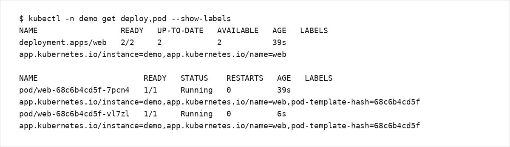

# 第3章：YAML基礎とメタデータ設計

Kubernetes は API オブジェクト（リソース）を宣言し、コントローラが差分を収束させます。  
そのため、マニフェストの品質（metadata 設計、Label/Selector の整合、Namespace の分離）が運用性を左右します。

## 学習目標
- マニフェストの基本構造（apiVersion/kind/metadata/spec）を説明できる
- Label/Selector を破綻させない設計原則を理解し、最小構成の YAML を作成できる
- Namespace を前提にしたリソース設計ができる

## 扱う範囲 / 扱わない範囲

### 扱う範囲
- YAML の最低限（インデント、配列、複数ドキュメント）
- Kubernetes オブジェクトの共通構造
- metadata: name/namespace/labels/annotations
- Selector の整合（Deployment/Service など）
- Namespace の使い分け

### 扱わない範囲
- CRD/Operator の設計
- ラベル仕様の詳細（制約や最大長などの網羅）

## YAML の最低限
- インデントはスペースで統一し、段差で構造を表現します（タブは使用しません）。
- 配列は `-` で表現します。
- 文字列は原則としてクォート無しでよいですが、`:` や `#` を含む場合はクォートします。
- 複数リソースを1ファイルで管理する場合は `---` で区切ります。

## Kubernetes オブジェクトの基本構造
多くのリソースは以下の形を取ります。

- `apiVersion`: API グループとバージョン（例: `apps/v1`）
- `kind`: リソース種別（例: `Deployment`）
- `metadata`: 識別子（name/namespace）と付加情報（labels/annotations）
- `spec`: 望ましい状態（Desired State）
- `status`: 現在の状態（Observed State、通常はコントローラが更新）

## metadata 設計

### name / namespace
- `metadata.name` は同一 namespace 内で一意です。
- 同一用途でも環境差分がある場合、namespace を分けます（例: `dev` / `stg` / `prod`）。

### labels（検索・集計・紐付けのキー）
labels は「検索/集計/Selector」に使います。運用上は以下を推奨します。

- アプリ識別: `app.kubernetes.io/name`
- インスタンス識別: `app.kubernetes.io/instance`
- （任意）役割: `app.kubernetes.io/component`
- （任意）版: `app.kubernetes.io/version`

重要:
- Selector に使うキーは、デプロイ後に変更しにくいため、最初に設計して固定します。
- `app: foo` のような短いキーを使う場合も、Selector に使うかどうかを分けて考えます。

### annotations（ツール連携・メタ情報）
annotations は Selector には使わず、ツール連携や説明情報に使います（例: `kubectl.kubernetes.io/last-applied-configuration`）。

## Selector と Label の整合
典型例は Deployment と Service です。

- Deployment: `.spec.selector.matchLabels` と `.spec.template.metadata.labels` が一致している必要があります。
- Service: `.spec.selector` が、対象 Pod の labels と一致している必要があります。

不整合があると「Pod が存在するのに Service の宛先が空」などの障害になります。

## Namespace 設計の入口
- 学習用途でも `default` に集約しないことを推奨します（意図しない衝突や削除事故が起きやすい）。
- 複数チーム/複数環境では、Namespace を境界として RBAC/Quota などに接続します（詳細は運用編で扱います）。

## ハンズオン：ラベル設計と検索
本章では `demo` namespace に `web` Deployment を作成し、ラベルで検索できることを確認します。

1) Namespace を作成します。

```bash
kubectl apply -f - <<'YAML'
apiVersion: v1
kind: Namespace
metadata:
  name: demo
YAML
```

2) Deployment を作成します。

```bash
kubectl apply -f - <<'YAML'
apiVersion: apps/v1
kind: Deployment
metadata:
  name: web
  namespace: demo
  labels:
    app.kubernetes.io/name: web
    app.kubernetes.io/instance: demo
spec:
  replicas: 2
  selector:
    matchLabels:
      app.kubernetes.io/name: web
      app.kubernetes.io/instance: demo
  template:
    metadata:
      labels:
        app.kubernetes.io/name: web
        app.kubernetes.io/instance: demo
    spec:
      containers:
        - name: web
          image: nginx:stable
          ports:
            - containerPort: 80
YAML
kubectl -n demo rollout status deploy/web
```

3) 確認します。

```bash
kubectl -n demo get deploy,pod --show-labels
kubectl -n demo get pod -l app.kubernetes.io/name=web,app.kubernetes.io/instance=demo
kubectl explain deployment.spec.selector
```

出力例（labels が `Deployment` と `Pod` に付与されていることの確認）:



## よくある落とし穴
- Selector に使う label を後から変更しようとして、Service/Deployment の紐付けが崩れる
- `metadata.namespace` を付け忘れ、default に作ってしまう
- `kubectl apply` と `kubectl create` を混在させ、意図せずマニフェストが単一の正に戻らない

## まとめ / 次に読む
- 次に読む: [第4章：Pod設計](../chapter04/)
