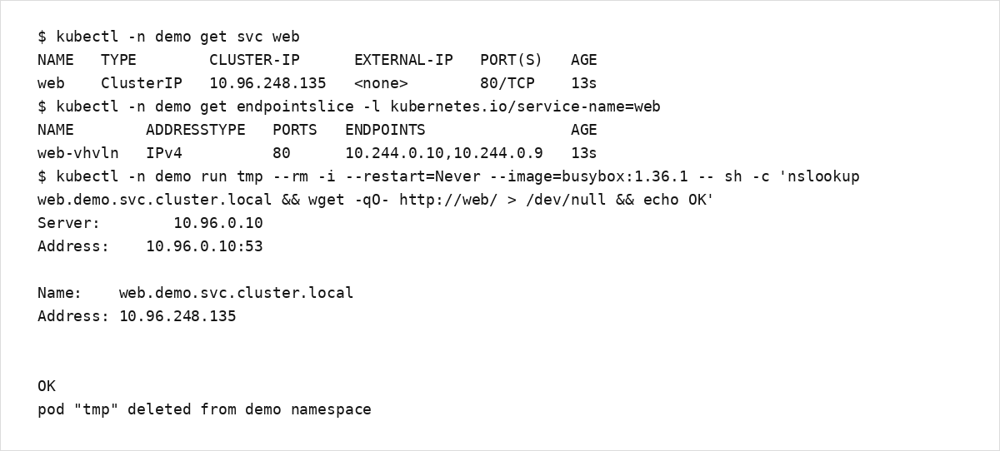

# 第6章：Serviceと名前解決

Service は、Pod 群に対する「安定した到達点」を提供するリソースです。  
Pod は短命で IP が変わり得るため、クライアントからは直接 Pod IP を参照しません。

## 学習目標
- Service の役割（負荷分散、安定した名前/IP）を説明できる
- Service の selector と Endpoints の関係を説明できる
- クラスタ内部 DNS の名前解決を確認できる

## 扱う範囲 / 扱わない範囲

### 扱う範囲
- ClusterIP / NodePort / LoadBalancer の概要
- selector と Endpoints（EndpointSlice）
- DNS 名の規則（`<svc>.<ns>.svc.cluster.local` の入口）

### 扱わない範囲
- L4/L7 の詳細設計（プロキシ方式の差分など）
- 外部ロードバランサの設計（クラウド依存）

## Service の基本
- `spec.selector` で対象 Pod を選びます。
- `spec.ports` で公開ポートと転送先ポートを定義します。
- Service 自体は Pod を作りません。到達性の抽象化です。

## Service の種別（概要）
- ClusterIP: クラスタ内部向け（デフォルト）
- NodePort: ノードのポートを外部に開ける（学習用途/制限あり）
- LoadBalancer: 外部 LB を前提（クラウド環境で一般的）

## DNS と名前解決
典型的な名前は以下です。

- `web`（同一 namespace 内の短縮）
- `web.demo`（namespace 指定）
- `web.demo.svc.cluster.local`（FQDN）

## ハンズオン：Service 経由の到達確認
前提: `demo` namespace に `web` Deployment と Service `web` が存在していること。

1) Endpoint を確認します。

```bash
kubectl -n demo get svc web
kubectl -n demo get endpointslice -l kubernetes.io/service-name=web
```

2) 一時的な Pod から名前解決と HTTP を確認します。

```bash
kubectl -n demo run tmp --rm -it --restart=Never --image=busybox:1.36.1 -- sh
# inside the pod
nslookup web.demo.svc.cluster.local
wget -qO- http://web/ > /dev/null
exit
```

出力例（EndpointSlice / 名前解決 / Service 到達性）:



## よくある落とし穴
- selector が一致せず、Endpoints が空になる（`kubectl describe svc` で確認する）
- `targetPort` の誤りで到達できない
- DNS の前提（CoreDNS）を意識せずに名前解決障害を切り分けられない

## まとめ / 次に読む
- 次に読む: [第7章：Ingress](../chapter07/)
