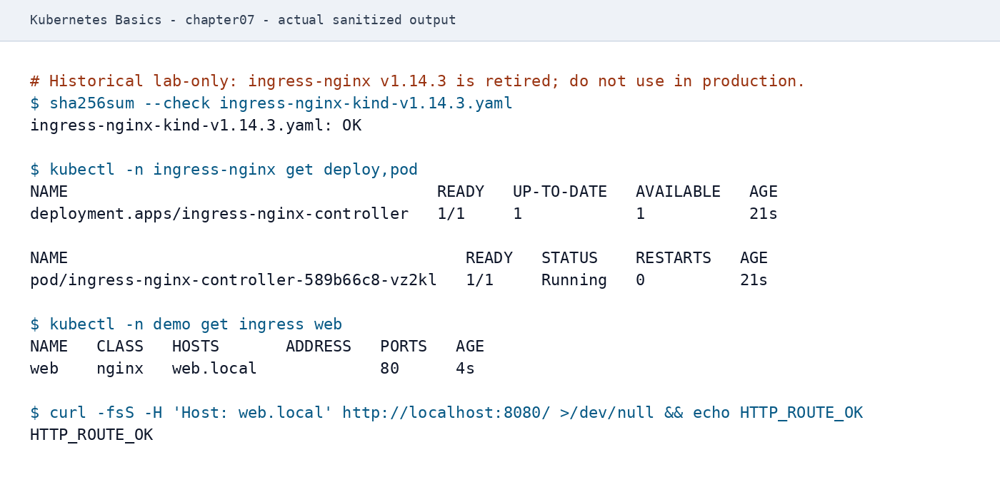

# 第7章：Ingress

Ingress は、HTTP(S) のルーティング（ホスト/パス）を Kubernetes のリソースとして宣言するための仕組みです。  
ただし Ingress リソースだけでは動作せず、Ingress Controller（この章の例では retired 済みの ingress-nginx）が必要です。

## 学習目標
- Ingress と Service の役割の違いを説明できる
- kind 環境で、retired 済み ingress-nginx の歴史的 lab を再現し、Ingress でルーティングできる
- ローカル環境で Host ベースルーティングの動作確認ができる

## 扱う範囲 / 扱わない範囲

### 扱う範囲
- Ingress Controller の概念
- ingress-nginx の歴史的 lab（kind）
- Host/Path ルーティングの最小構成
- TLS の入口（Secret の使い方の概要）

### 扱わない範囲
- Ingress Controller の高度な設定（WAF、rate limit、細かなチューニング）
- cert-manager 等による証明書自動化（別途検討）

## Ingress の前提: Ingress Controller
- Ingress は「宣言」であり、実際の L7 ルーティングを実装するのは Controller です。
- Controller はクラスタに常駐し、Ingress の変更を監視して設定に反映します。

公式ドキュメントでは、Ingress API は stable ですが凍結されており、新しい機能追加は Gateway API 側で進む方針です。
本書では既存環境で今も広く使われる Ingress の基礎を扱いますが、新規の本番設計では利用する Controller の保守状況と Gateway API への移行方針も確認してください。

### ingress-nginx v1.14.3 の位置づけ
この章の `controller-v1.14.3` は、再現性を確認するために残す**歴史的な学習用（historical lab-only）**の例です。Kubernetes 公式発表のとおり、Ingress NGINX は **2026年3月に retired** となり、その後はリリース、bugfix、**セキュリティ修正が提供されません**。既存の成果物が取得できても、**本番利用は推奨しません**。

新規の学習・本番設計では [Gateway API](https://kubernetes.io/docs/concepts/services-networking/gateway/) を現行経路の出発点とし、選定する保守中の implementation について、[公式 implementation 一覧](https://gateway-api.sigs.k8s.io/docs/implementations/list/) と [公式 conformance](https://gateway-api.sigs.k8s.io/docs/concepts/conformance/) で対象 bundle、profile、Route 種別、conformance report、保守状況を確認してください。本書は特定製品を推奨しません。

## kind への ingress-nginx 導入（歴史的ハンズオン）
前提:
- 第2章の kind 設定により、ホスト側 `8080/8443` が kind ノードの `80/443` にマッピングされていること

1) 歴史的 lab として ingress-nginx を導入します（kind provider 用マニフェスト）。新規の本番環境へこの手順を適用しないでください。

```bash
set -euo pipefail

INGRESS_NGINX_COMMIT=451747c70c6fca688e157a8329a3dd219a234fd9
INGRESS_NGINX_SHA256=e4198bf3fcbfecb510516fa6fab3db9cd1132d524896d866101ab6faca1fbc31
MANIFEST=ingress-nginx-kind-v1.14.3.yaml

curl -fsSLo "$MANIFEST" \
  "https://raw.githubusercontent.com/kubernetes/ingress-nginx/${INGRESS_NGINX_COMMIT}/deploy/static/provider/kind/deploy.yaml"
if command -v sha256sum >/dev/null 2>&1; then
  printf '%s  %s\n' "$INGRESS_NGINX_SHA256" "$MANIFEST" | sha256sum --check -
elif command -v shasum >/dev/null 2>&1; then
  printf '%s  %s\n' "$INGRESS_NGINX_SHA256" "$MANIFEST" | shasum -a 256 --check
else
  echo 'SHA-256 verifier (sha256sum or shasum) is required' >&2
  exit 1
fi
kubectl apply -f "$MANIFEST"
kubectl -n ingress-nginx get pods -w
```

補足:
- 本書では歴史的 lab の再現性のため、ingress-nginx v1.14.3 のcommit `451747c70c6fca688e157a8329a3dd219a234fd9`とマニフェストのSHA-256を固定しています。適用前にchecksum検証を成功させ、取得失敗や内容差分がある場合は適用を中止してください。
- この版は retired 済みで、リリース、bugfix、セキュリティ修正が提供されないため、本番利用は推奨しません。
- 現行の選定では、[Gateway API の公式 implementation 一覧](https://gateway-api.sigs.k8s.io/docs/implementations/list/) と [公式 conformance](https://gateway-api.sigs.k8s.io/docs/concepts/conformance/) を確認し、implementation の公式ドキュメント、対象 bundle/profile/Route、conformance report、保守状況を自分の要件と照合してください。
- 退役したプロジェクトの履歴確認: [Ingress NGINX retirement（Kubernetes 公式）](https://kubernetes.io/blog/2025/11/11/ingress-nginx-retirement/)

補足: `get pods -w` の代替として、`rollout status` で待つこともできます。

```bash
kubectl -n ingress-nginx rollout status deploy/ingress-nginx-controller
```

2) Controller が Ready になることを確認します。

```bash
kubectl -n ingress-nginx get svc,deploy,pod
```

## ハンズオン：Host ルーティングの最小構成
前提: `demo` namespace に `web` Deployment と Service `web` が存在していること（第5章/第6章の状態）。

1) Ingress を作成して適用します。

```bash
kubectl -n demo apply -f - <<'YAML'
apiVersion: networking.k8s.io/v1
kind: Ingress
metadata:
  name: web
  namespace: demo
spec:
  ingressClassName: nginx
  rules:
    - host: web.local
      http:
        paths:
          - path: /
            pathType: Prefix
            backend:
              service:
                name: web
                port:
                  number: 80
YAML
```

2) Ingress を確認します。

```bash
kubectl -n demo get ingress
kubectl -n demo describe ingress web
```

3) ローカルから到達確認します（Host ヘッダを付与します）。

補足: apply 直後は反映に数秒かかることがあります（その場合は数秒待って再実行してください）。

```bash
curl -fsS -H 'Host: web.local' http://localhost:8080/ > /dev/null
```

出力例（ingress-nginx の歴史的 lab：導入〜Ingress 作成〜疎通確認）:

<a id="figure-ch07-ingress-nginx-01"></a>


_2026-07-23（JST）取得。隔離kind環境、Kubernetes 1.35.0、kubectl 1.35.1、kind 0.31.0、ingress-nginx 1.14.3（retired）。checksum、controller 1/1、Ingress、HTTP_ROUTE_OKを見て歴史的labの再現成功を判断します。本番利用の推奨ではありません。_

### （任意）ブラウザで確認する
DNS が無い環境でも、hosts を使うとブラウザで確認できます（管理者権限が必要です）。

OS別の hosts ファイル:
- macOS/Linux: `/etc/hosts`
- Windows: `C:\Windows\System32\drivers\etc\hosts`

macOS/Linux の例:

```bash
echo "127.0.0.1 web.local" | sudo tee -a /etc/hosts
```

Windows の例（管理者権限で編集して追記）:

```text
127.0.0.1 web.local
```

そのうえで、ブラウザで `http://web.local:8080/` を開きます。

## TLS（入口）
- Ingress の TLS は `spec.tls` で `secretName` を参照します。
- まずは手動作成で概念を掴み、実運用は証明書管理の仕組み（例: cert-manager）を別途検討してください。

## よくある落とし穴
- Ingress Controller を導入せず、Ingress リソースだけを作っても到達できない
- ローカル環境では DNS がないため、Host ヘッダや hosts 設定が必要になる
- kind のポートマッピングがないため、ローカルから `localhost` で到達できない

## まとめ / 次に読む
- 本章の ingress-nginx は historical lab-only です。新規の学習・本番設計では Gateway API と、公式 implementation/conformance 情報で保守状況を確認した implementation を検討してください。
- 次に読む: [第8章：ConfigMapとSecret](../chapter08/)
