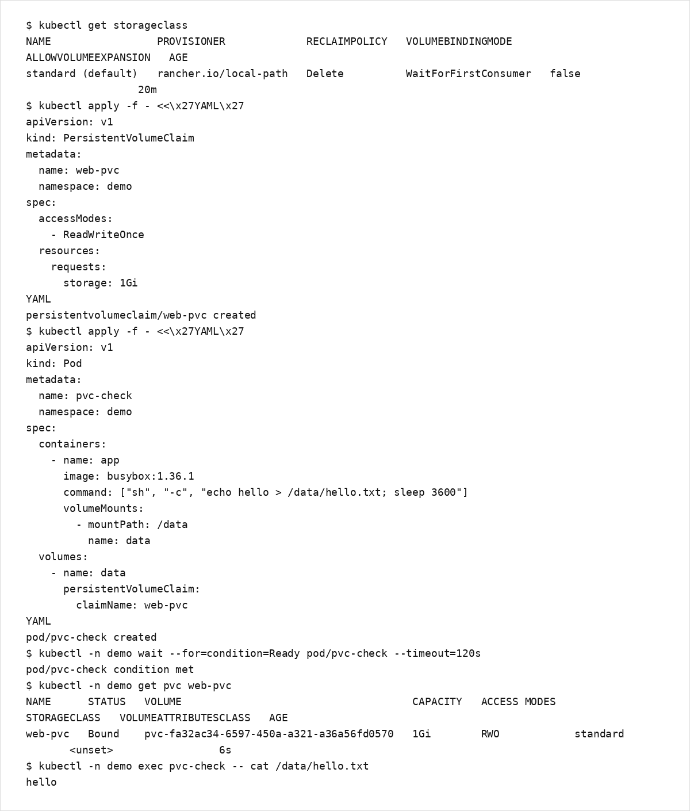

# 第9章：ストレージ基礎

Pod は短命であり、コンテナのファイルシステムは原則として揮発的です。  
永続化が必要なデータ（DB、キュー、アップロードファイル等）は、Volume/PV/PVC を用いて管理します。

## 学習目標
- PV/PVC/StorageClass の役割分担を説明できる
- 動的プロビジョニングの概念を説明できる
- 学習環境（kind）でストレージ検証する際の注意点を理解する

## 扱う範囲 / 扱わない範囲

### 扱う範囲
- Volume/PV/PVC/StorageClass の基本
- 動的プロビジョニング（概念と入口）
- Stateful ワークロードの入口（StatefulSet の位置付け）

### 扱わない範囲
- 特定ストレージ製品の詳細設計（性能/冗長/バックアップ機構の深掘り）
- 本番のデータ保護設計（運用編で扱う）

## 用語整理（最小）
- Volume: Pod にマウントされるストレージ（抽象）
- PersistentVolume（PV）: クラスタ側のストレージリソース
- PersistentVolumeClaim（PVC）: 利用側（namespace 側）の要求
- StorageClass: 動的プロビジョニングのクラス（どのプロビジョナで作るか）

## 動的プロビジョニング
クラウド環境では、PVC を作成すると StorageClass に応じて PV が自動作成される構成が一般的です。  
一方、学習用のローカルクラスタでも、StorageClass とプロビジョナが用意されていれば動的プロビジョニングできます。  
kind のデフォルト構成では、StorageClass `standard`（local-path provisioner）が利用できるのが一般的です。

## ハンズオン：PVC を作成して Pod にマウントする（kind）
補足:
- kind のデフォルト StorageClass は `VolumeBindingMode: WaitForFirstConsumer` であることがあります。  
  この場合、PVC は「利用する Pod」が作成されるまで `Pending` のままに見えることがあります。

1) StorageClass を確認します。

```bash
kubectl get storageclass
```

2) PVC を作成します（default StorageClass を利用します）。

```bash
kubectl apply -f - <<'YAML'
apiVersion: v1
kind: PersistentVolumeClaim
metadata:
  name: web-pvc
  namespace: demo
spec:
  accessModes:
    - ReadWriteOnce
  resources:
    requests:
      storage: 1Gi
YAML
```

3) PVC を利用する Pod を作成し、Bound になることを確認します。

```bash
kubectl apply -f - <<'YAML'
apiVersion: v1
kind: Pod
metadata:
  name: pvc-check
  namespace: demo
spec:
  containers:
    - name: app
      image: busybox:1.36.1
      command: ["sh", "-c", "echo hello > /data/hello.txt; sleep 3600"]
      volumeMounts:
        - mountPath: /data
          name: data
  volumes:
    - name: data
      persistentVolumeClaim:
        claimName: web-pvc
YAML
```

4) 確認します。

```bash
kubectl -n demo wait --for=condition=Ready pod/pvc-check --timeout=120s
kubectl -n demo get pvc web-pvc
kubectl -n demo exec pvc-check -- cat /data/hello.txt
```

出力例（PVC 作成〜Pod でのマウント〜データ永続化の確認。PVC が `Bound` で、`/data/hello.txt` に `hello` があることを確認）:



5) 片付け（任意）

```bash
kubectl -n demo delete pod pvc-check
kubectl -n demo delete pvc web-pvc
```

### 補足：StorageClass が無い場合
学習環境に StorageClass/プロビジョナが存在しない場合、PVC が `Pending` のままになります。  
その場合は、学習用途として local-path-provisioner を導入する方法があります。

```bash
kubectl apply -f https://raw.githubusercontent.com/rancher/local-path-provisioner/v0.0.34/deploy/local-path-storage.yaml
kubectl get storageclass
```

## よくある落とし穴
- 学習環境にストレージプロビジョナがなく、PVC が Pending のままになる
- 永続化が必要なデータを emptyDir に置いてしまう（再スケジュールで消える）
- ストレージの責任範囲（バックアップ、復旧、SLA）を曖昧にしたまま本番運用する

## まとめ / 次に読む
- 次に読む: [第10章：基本トラブルシューティング](../chapter10/)
