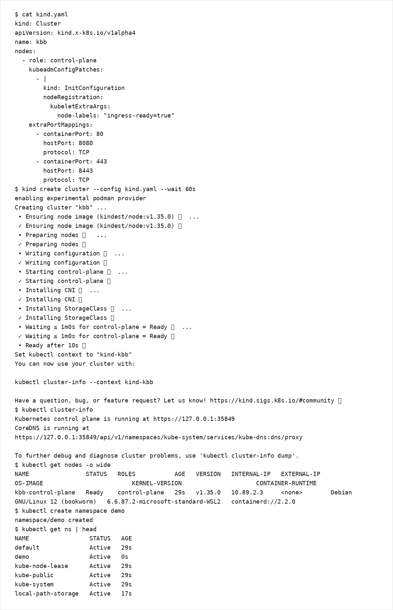

# 第2章：ローカル環境とkubectl

本章では、ローカルで Kubernetes クラスタを用意し、kubectl の最低限の操作体系（観測・適用・デバッグ）を身につけます。

## 学習目標
- kind でローカルクラスタを作成し、kubectl で接続確認できる
- 名前空間を意識してリソースを作成/確認/削除できる
- logs/exec/port-forward で最低限のデバッグができる

## 扱う範囲 / 扱わない範囲

### 扱う範囲
- kind によるクラスタ作成
- kubectl の基本操作（get/describe/apply/delete/logs/exec/port-forward）
- context / namespace の扱い

### 扱わない範囲
- 本番相当のクラスタ設計（HA、監視、アップグレード、ノード運用）

## 前提知識・準備
- `curl` 等の HTTP クライアント（動作確認用）

## ローカルクラスタの選択
本書では kind を標準とします。

- kind: 軽量で再現性が高い（学習用途に適する）
- minikube: アドオン（Ingress/Storage）が揃っており、環境差分が出にくい

本書の記述は kind 前提で記載し、差分が大きい場合は補足します。

補足:
- kind はローカルのコンテナ実行環境（一般には Docker）を利用します。
- Docker を使えない場合は、代替として minikube を検討してください。
- Podman で kind を動かすこともできますが experimental 扱いです。詳細は公式ドキュメントを参照してください。
  - https://kind.sigs.k8s.io/

## kubectl のインストール
kubectl は Kubernetes の minor バージョンに揃えることを推奨します。  
インストール手順は公式Docsを参照してください。

- https://kubernetes.io/docs/tasks/tools/

## kind のインストール
kind のインストール手順は公式Docsを参照してください。

- https://kind.sigs.k8s.io/docs/user/quick-start/

## kind クラスタ作成（Ingress 前提）
Ingress を後続章で扱うため、control-plane ノードに `ingress-ready=true` を付与し、80/443 をホスト側にマッピングします。  
特権ポートを避けるため、ホスト側は 8080/8443 を使用します。

1) `kind.yaml` を作成します。

```bash
cat > kind.yaml <<'YAML'
kind: Cluster
apiVersion: kind.x-k8s.io/v1alpha4
name: kbb
nodes:
  - role: control-plane
    kubeadmConfigPatches:
      - |
        kind: InitConfiguration
        nodeRegistration:
          kubeletExtraArgs:
            node-labels: "ingress-ready=true"
    extraPortMappings:
      - containerPort: 80
        hostPort: 8080
        protocol: TCP
      - containerPort: 443
        hostPort: 8443
        protocol: TCP
YAML
```

補足: 上記の `kind.yaml` では `name: kbb` を指定しているため、クラスタ名は `kbb` になります。

2) クラスタ作成と確認を行います。

```bash
kind create cluster --config kind.yaml
kubectl cluster-info
kubectl get nodes -o wide
```

3) Namespace を作成します（本書の共通ハンズオン）。

```bash
kubectl create namespace demo
kubectl get ns
```

出力例（`kind.yaml` の確認〜クラスタ作成〜Namespace 作成）:



## kubectl 基本操作（最小セット）

### 1. 観測（get / describe）
```bash
kubectl -n demo get all
kubectl -n demo describe pod <pod-name>
kubectl -n demo get events --sort-by=.lastTimestamp
# 補足: lastTimestamp が期待どおりでない場合
kubectl -n demo get events --sort-by=.metadata.creationTimestamp
```

### 2. 適用（apply / delete）
```bash
kubectl apply -f <manifest.yaml>
kubectl delete -f <manifest.yaml>
```

### 3. デバッグ（logs / exec / port-forward）
```bash
kubectl -n demo logs <pod-name>
kubectl -n demo exec -it <pod-name> -- sh

kubectl -n demo port-forward svc/<service-name> 8081:80
```

## ハンズオン：最小のデプロイと疎通
本節は後続章の前提となる「デプロイ→Service→疎通」の最小手順を確認します。

1) Deployment を作成します（YAML の詳細は第3章で扱います）。

```bash
kubectl apply -f - <<'YAML'
apiVersion: apps/v1
kind: Deployment
metadata:
  name: web
  namespace: demo
  labels:
    app.kubernetes.io/name: web
    app.kubernetes.io/instance: demo
spec:
  replicas: 1
  selector:
    matchLabels:
      app.kubernetes.io/name: web
      app.kubernetes.io/instance: demo
  template:
    metadata:
      labels:
        app.kubernetes.io/name: web
        app.kubernetes.io/instance: demo
    spec:
      containers:
        - name: web
          image: nginx:stable
          ports:
            - containerPort: 80
YAML
kubectl -n demo rollout status deploy/web
kubectl -n demo get deploy,pod -o wide
```

2) Service を作成します。

```bash
kubectl -n demo expose deployment web --name web --port 80
kubectl -n demo get svc web
```

3) port-forward で疎通します。

```bash
kubectl -n demo port-forward svc/web 8081:80
curl -fsS http://localhost:8081/ > /dev/null
```

## よくある落とし穴
- `-n demo` を付け忘れ、意図しない namespace（default）に作成してしまう
- `kubectl config current-context` を確認せず、別クラスタに apply してしまう
- kind の port mapping を作らずに Ingress を試し、ローカルから到達できない

## 片付け（クリーンアップ）
```bash
kind delete cluster --name kbb
```

## まとめ / 次に読む
- 次に読む: [第3章：YAML基礎とメタデータ設計](../chapter03/)
