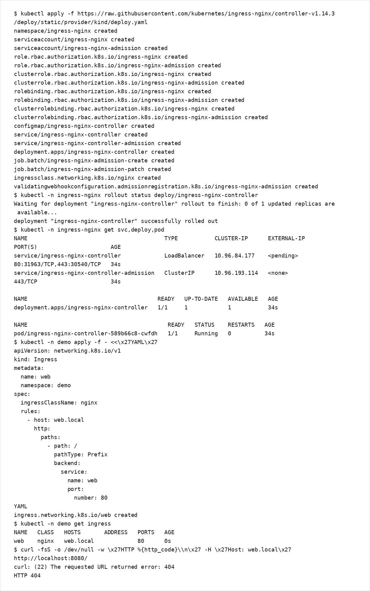

# 第7章：Ingress

Ingress は、HTTP(S) のルーティング（ホスト/パス）を Kubernetes のリソースとして宣言するための仕組みです。  
ただし Ingress リソースだけでは動作せず、Ingress Controller（例: ingress-nginx）が必要です。

## 学習目標
- Ingress と Service の役割の違いを説明できる
- kind 環境に ingress-nginx を導入し、Ingress でルーティングできる
- ローカル環境で Host ベースルーティングの動作確認ができる

## 扱う範囲 / 扱わない範囲

### 扱う範囲
- Ingress Controller の概念
- ingress-nginx の導入（kind）
- Host/Path ルーティングの最小構成
- TLS の入口（Secret の使い方の概要）

### 扱わない範囲
- Ingress Controller の高度な設定（WAF、rate limit、細かなチューニング）
- cert-manager 等による証明書自動化（別途検討）

## Ingress の前提: Ingress Controller
- Ingress は「宣言」であり、実際の L7 ルーティングを実装するのは Controller です。
- Controller はクラスタに常駐し、Ingress の変更を監視して設定に反映します。

## kind への ingress-nginx 導入
前提:
- 第2章の kind 設定により、ホスト側 `8080/8443` が kind ノードの `80/443` にマッピングされていること

1) ingress-nginx を導入します（kind provider 用マニフェスト）。

```bash
kubectl apply -f https://raw.githubusercontent.com/kubernetes/ingress-nginx/controller-v1.14.3/deploy/static/provider/kind/deploy.yaml
kubectl -n ingress-nginx get pods -w
```

補足:
- 本書では再現性のため ingress-nginx のマニフェストを特定バージョンに固定しています。
- 更新する場合は ingress-nginx の公式リリース/インストールドキュメントを確認してください。
  - https://github.com/kubernetes/ingress-nginx/releases
  - https://kubernetes.github.io/ingress-nginx/

補足: `get pods -w` の代替として、`rollout status` で待つこともできます。

```bash
kubectl -n ingress-nginx rollout status deploy/ingress-nginx-controller
```

2) Controller が Ready になることを確認します。

```bash
kubectl -n ingress-nginx get svc,deploy,pod
```

## ハンズオン：Host ルーティングの最小構成
前提: `demo` namespace に `web` Deployment と Service `web` が存在していること（第5章/第6章の状態）。

1) Ingress を作成して適用します。

```bash
kubectl -n demo apply -f - <<'YAML'
apiVersion: networking.k8s.io/v1
kind: Ingress
metadata:
  name: web
  namespace: demo
spec:
  ingressClassName: nginx
  rules:
    - host: web.local
      http:
        paths:
          - path: /
            pathType: Prefix
            backend:
              service:
                name: web
                port:
                  number: 80
YAML
```

2) Ingress を確認します。

```bash
kubectl -n demo get ingress
kubectl -n demo describe ingress web
```

3) ローカルから到達確認します（Host ヘッダを付与します）。

補足: apply 直後は反映に数秒かかることがあります（その場合は数秒待って再実行してください）。

```bash
curl -fsS -H 'Host: web.local' http://localhost:8080/ > /dev/null
```

出力例（ingress-nginx 導入〜Ingress 作成〜疎通確認）:



### （任意）ブラウザで確認する
DNS が無い環境でも、hosts を使うとブラウザで確認できます（管理者権限が必要です）。

OS別の hosts ファイル:
- macOS/Linux: `/etc/hosts`
- Windows: `C:\Windows\System32\drivers\etc\hosts`

macOS/Linux の例:

```bash
echo "127.0.0.1 web.local" | sudo tee -a /etc/hosts
```

Windows の例（管理者権限で編集して追記）:

```text
127.0.0.1 web.local
```

そのうえで、ブラウザで `http://web.local:8080/` を開きます。

## TLS（入口）
- Ingress の TLS は `spec.tls` で `secretName` を参照します。
- まずは手動作成で概念を掴み、実運用は証明書管理の仕組み（例: cert-manager）を別途検討してください。

## よくある落とし穴
- Ingress Controller を導入せず、Ingress リソースだけを作っても到達できない
- ローカル環境では DNS がないため、Host ヘッダや hosts 設定が必要になる
- kind のポートマッピングがないため、ローカルから `localhost` で到達できない

## まとめ / 次に読む
- 次に読む: [第8章：ConfigMapとSecret](../chapter08/)
